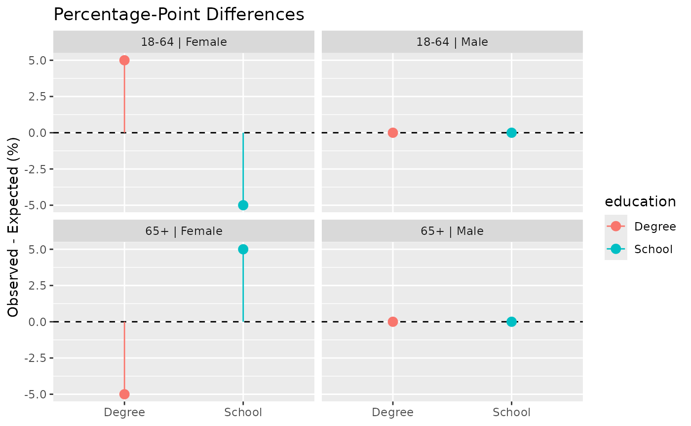

# replica

``` r

library(replica)
```

## Motivation

`replica` is an R package for generating synthetic populations of
individual agents and households from aggregated data.

The package has been developed to support health-economic
microsimulation modelling and other applications requiring realistic
synthetic populations.

`replica` provides tools for:

- creating synthetic agents from aggregate count data;

- assigning demographic and behavioural attributes using contingency
  tables;

- generating synthetic households; and

- evaluating synthetic population quality.

`replica` implements an R version of the synthetic population generation
methodology described by de Mooij et al. (2024) and additionally
provides functionality for validation, visualisation and workflow
integration within the R ecosystem.

## Status

This development version of `replica` has been made available as part of
the process of testing and documenting the library.

**Note - the `replica` library is currently very experimental. It is
still undergoing active development and testing. Function, class and
method names, arguments and syntax may change without the use of
deprecation conventions. This library should currently be used only for
exploratory purposes.**

## The Population Generation Workflow

The workflow supported by `replica` can be summarised as:

Aggregate Counts ↓
[`make_agents()`](https://ready4-dev.github.io/replica/reference/make_agents.md)
↓ Synthetic Agents ↓ `ReplicaAdder` ↓ Enriched Population ↓
`ReplicaStructure` + `ReplicaGrouper` ↓ Synthetic Households ↓
Validation

Each stage is described in a dedicated vignette.

## Core Concepts

### Synthetic Agents

Synthetic agents are individual records representing people within a
synthetic population.

The
[`make_agents()`](https://ready4-dev.github.io/replica/reference/make_agents.md)
function expands aggregate demographic counts into one row per synthetic
individual.

Example:

``` r

age_group <- data.frame(
  age_group = c(
    "0-17",
    "18-64",
    "65+"
  ),
  count = c(
    200,
    600,
    200
  )
)

agents <- make_agents(
  age_group
)
```

### Attribute Assignment

Synthetic populations often require additional characteristics beyond
those available in the source data.

`ReplicaAdder` assigns new attributes while preserving known demographic
relationships.

Examples include:

- education;

- employment status;

- occupation;

- income category; and

- health status.

### Household generation

Many modelling applications require individuals to be organised into
households.

Household generation is controlled using:

- `ReplicaStructure`

- `ReplicaGrouper`

Household structures are generated while respecting demographic and
geographic constraints.

### Validation

Synthetic populations should be evaluated to ensure they reproduce the
source distributions used during construction.

`replica` provides tools for:

- contingency-table reconstruction;

- goodness-of-fit statistics;

- validation diagnostics; and

- validation visualisations.

## Vignettes

The package documentation follows the complete synthetic population
generation workflow.

[Vignette 1: Generating Synthetic Populations from Aggregated
Data](https://ready4-dev.github.io/replica/articles/V_01.md):

- introduces
  [`make_agents()`](https://ready4-dev.github.io/replica/reference/make_agents.md);
  and

- demonstrates how aggregate count data can be converted into individual
  synthetic agents.

[Vignette 2: Assigning Attributes Using Contingency
Tables](https://ready4-dev.github.io/replica/articles/V_02.md):

- introduces `ReplicaAdder`; and

- demonstrates how to enrich synthetic agents using contingency tables
  and demographic distributions.

[Vignette 3: Generating Synthetic
Households](https://ready4-dev.github.io/replica/articles/V_03.md):

- introduces `ReplicaStructure` and `ReplicaGrouper`; and

- demonstrates how enriched agents can be organised into realistic
  household structures.

[Vignette 4: Evaluating Synthetic Population
Quality](https://ready4-dev.github.io/replica/articles/V_04.md):

- introduces
  [`plot_validation_distributions()`](https://ready4-dev.github.io/replica/reference/plot_validation_distributions.md),
  [`plot_validation_differences()`](https://ready4-dev.github.io/replica/reference/plot_validation_differences.md)
  and
  [`plot_validation_heatmap()`](https://ready4-dev.github.io/replica/reference/plot_validation_heatmap.md);

- demonstrates how synthetic populations can be assessed and validated.

## Example Workflow

The following example illustrates how the major components of `replica`
fit together.

### Create Synthetic Agents

``` r

age_gender <- data.frame(
  age_group = c("18-64","18-64","65+","65+"),
  gender = c("Male","Female","Male","Female"),
  count = c(10, 10, 10, 10))
agents <- make_agents(age_gender)
```

## Assign Additional Attributes

``` r

education_table <- data.frame(
  age_group = c("18-64", "18-64", "18-64", "18-64",
                "65+",   "65+",  "65+",   "65+"),
  gender = c("Male", "Male", "Female", "Female",
             "Male", "Male", "Female", "Female"),
  education = c("Degree", "School","Degree", "School",
                "Degree", "School","Degree", "School"),
  count = c(60, 40, 55, 45, 30, 70, 25, 75)

)
ADDER <- ReplicaAdder(
  population = agents,
  contingency_table = education_table,
  target_attribute = "education",
  group_by = c("age_group","gender")

)
ADDER <- enhance(ADDER)
population <- procure(ADDER, "population")
```

### Generate Households

``` r

population[,neighb_code := "N1"]

population[,household_position := "Parent"]

population[age_group == "18-64",
           age := sample(18:64, .N, replace = TRUE)]

population[age_group == "65+", 
           age := sample(65:95,.N, replace = TRUE)]

STRUCTURE <- ReplicaStructure("CoupleHousehold")

STRUCTURE <- renew(STRUCTURE,
                   what = "positions",
                   household_position = "Parent",
                   position_identifier = "adult",
                   amount = 2,
                   backup_position_identifiers = character())

STRUCTURE <- renew(STRUCTURE, 
                   couple_gender_distribution = c("Female|Male" = 1))

STRUCTURE <- renew(STRUCTURE, 
                   couple_age_distribution = c("-5-5" = 1))

GROUPER <- ReplicaGrouper(population = population,
                       group_by = "neighb_code")

GROUPER <- renew(GROUPER, what = "structure",
                 structure = STRUCTURE)

households <- manufacture(GROUPER)
```

### Inspect Results

``` r

head(households$synthetic_population)
#>    agent_id age_group gender education neighb_code household_position   age
#>      <char>    <char> <char>    <char>      <char>             <char> <int>
#> 1: Agent_01     18-64   Male    Degree          N1             Parent    18
#> 2: Agent_02     18-64   Male    Degree          N1             Parent    42
#> 3: Agent_03     18-64   Male    Degree          N1             Parent    64
#> 4: Agent_04     18-64   Male    Degree          N1             Parent    54
#> 5: Agent_05     18-64   Male    Degree          N1             Parent    25
#> 6: Agent_06     18-64   Male    School          N1             Parent    50
#>    household_id
#>          <char>
#> 1:    SSH000005
#> 2:    SSH000001
#> 3:    SSH000007
#> 4:    SSH000004
#> 5:    SSH000002
#> 6:    SSH000009
```

``` r

head(households$synthetic_households)
#>   household_id neighb_code  household_type household_size
#> 1    SSH000001          N1 CoupleHousehold              2
#> 2    SSH000002          N1 CoupleHousehold              2
#> 3    SSH000003          N1 CoupleHousehold              2
#> 4    SSH000004          N1 CoupleHousehold              2
#> 5    SSH000005          N1 CoupleHousehold              2
#> 6    SSH000006          N1 CoupleHousehold              2
```

### Validate Attribute Assignment

``` r

procure(ADDER, "validation_results")[c("z_square","p_value", 
                           "warning_required")]
#> $z_square
#> [1] 2.155412
#> 
#> $p_value
#> [1] 0.9758728
#> 
#> $warning_required
#> [1] FALSE
```

``` r

plot_validation_differences(procure(ADDER, "validation_results"))
```



This workflow demonstrates the complete progression from aggregate
demographic data to synthetic agents, enriched populations, synthetic
households and validation outputs.

## References

de Mooij J, Sonnenschein T, Pellegrino M, Dastani M, Ettema D, Logan B
and Verstegen JA (2024).

*GenSynthPop: generating a spatially explicit synthetic population of
individuals and households from aggregated data.*

Autonomous Agents and Multi-Agent Systems.
<https://link.springer.com/article/10.1007/s10458-024-09680-7>
